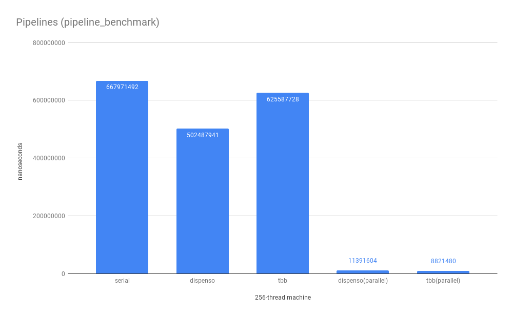

[](https://app.circleci.com/pipelines/github/facebookincubator/dispenso)

# Dispenso

- [Introduction](#introduction)
  - [Comparison of dispenso vs other libraries](#comparison)
  - [When not to use dispenso](#nottouse)
  - [Documentation and Examples](#examples)
- [Building dispenso](#building)
- [Testing dispenso](#testing)
- [Benchmarking dispenso](#benchmarking)
  - [Benchmark results](#benchresults)
- [Known Issues](#knownissues)
- [Licensing](#licensing)


<div id='introduction'/>

# Introduction

Latin: *To dispense, distribute, manage*

Dispenso is a library for working with sets of tasks in parallel.  It provides mechanisms for thread pools, task sets, parallel for loops, futures, pipelines, and more.  Dispenso is a well-tested C++14 library designed to have minimal dependencies (some dependencies are required for the tests and benchmarks), and designed to be clean with compiler sanitizers (ASAN, TSAN).  Dispenso is currently being used in dozens of projects and hundreds of C++ files at Meta (formerly Facebook).

Dispenso has the following features
* **`AsyncRequest`**: Asynchronous request/response facilities for lightweight constrained message passing
* **`CompletionEvent`**: A notifiable event type with wait and timed wait
* **`ConcurrentObjectArena`**: An object arena for fast allocation of objects of the same type
* **`ConcurrentVector`**: A vector-like type with a superset of the TBB concurrent_vector API
* **`for_each`**: Parallel version of `std::for_each` and `std::for_each_n`
* **`Future`**: A futures implementation that strives for interface similarity with std::experimental::future, but with dispenso types as backing thread pools
* **`OnceFunction`**: A lightweight function-like interface for `void()` functions that can only be called once
* **`parallel_for`**: Parallel for loops over indices that can be blocking or non-blocking
* **`pipeline`**: Parallel pipelining of workloads
* **`PoolAllocator`**: A pool allocator with facilities to supply a backing allocation/deallocation, making this suitable for use with e.g. CUDA allocation
* **`ResourcePool`**: A type that acts similar to a semaphore around guarded objects
* **`RWLock`**: A minimal reader-writer spin lock that outperforms std::shared_mutex under low write contention
* **`SmallBufferAllocator`**: An allocator that enables fast concurrent allocation for temporary objects
* **`TaskSet`**: Sets of tasks that can be waited on together
* **`ThreadPool`**: The backing thread pool type used by many other dispenso features

<div id='comparison'/>

## Comparison of dispenso vs other libraries
### TBB
TBB has significant overlap with dispenso, though TBB has more functionality, and is likely to continue having more utilities for some time.   We chose to build and use dispenso for a few primary reasons like
1. TBB is built on older C++ standards, and doesn't deal well with compiler sanitizers
2. TBB lacks an interface for futures
3. We wanted to ensure we could control performance and availability on non-Intel hardware

Dispenso is faster than TBB in some scenarios and slower in other scenarios.  For example, with parallel for loops, dispenso tends to be faster for small and medium loops, and on-par with TBB for large loops.  When many loops can run independently of one another, dispenso shines and can perform significantly better than TBB.  Anecdotally speaking, we have seen one workload with independent parallel for loops at Meta where porting to dispenso lead to a 50% speedup. 

### OpenMP
OpenMP has very simple semantics for parallelizing simple for loops, but gets quite complex for more complicated loops and constructs.  OpenMP wasn't as portable in the past, though the number of compiler supporting it is increasing.  If not used carefully, nesting of OpenMP constructs inside of other threads (e.g. nested parallel for) can lead to large number of threads, which can exhaust machines.

Performance-wise, dispenso tends to outperform simple OpenMP for loops for medium and large workloads, but OpenMP has a significant advantage for small loops.  This is because it has direct compiler support and can understand the cost of the code it is running.  This allows it to forgo running in parallel if the tradeoffs aren't worthwhile.

### Folly
Folly is a library from Meta that has several concurrency utilities including thread pools and futures.  The library has very good support for new C++ coroutines functionality, and makes writing asynchronous code (e.g. I/O) easy and performant.  Folly as a library can be tricky to work with.  For example, the forward/backward compatibility of code isn't a specific goal of the project.

Folly does not have a parallel loop concept, nor task sets and parallel pipelines.  When comparing Folly's futures against dispenso's, dispenso tries to maintain an API that is closely matched to a combination of std::experimental::future and std::experimental::shared_future (dispenso's futures are all shared).  Additionally, for compute-bound applications, dispenso's futures tend to be much faster and lighter-weight than Folly's.

### Grand central dispatch, new std C++ parallelism, others
We haven't done a strong comparison vs these other mechanisms.  GCD is an Apple technology used by many people for Mac and iOS platforms, and there are ports to other platforms (though the mechanism for submitting closures is different).  Much of the C++ parallel algorithms work is still TBD, but we would be very interested to enable dispenso to be a basis for parallelization of those algorithms.  Additionally, we have interest in enabling dispenso to back the new coroutines interface.  We'd be interested in any contributions people would like to make around benchmarking/summarizing other task parallelism libraries, and also integration with C++ parallel algorithms and coroutines.

<div id='nottouse'/>

## When (currently) *not* to use dispenso
Dispenso isn't really designed for high-latency task offload, it works best for compute-bound tasks.  Using the thread pool for networking, disk, or in cases with frequent TLB misses (really any scenario with kernel context switches) may result in less than ideal performance.

In these kernel context switch scenarios, `dispenso::Future` can be used with `dispeno::NewThreadInvoker`, which should be roughly equivalent with std::future performance.

If you need async I/O, Folly is likely a good choice (though it still doesn't fix e.g. TLB misses).

<div id='examples'/>

## Documentation and Examples
[Documentation can be found here](./docs/index.html)

Here are some simple examples of what you can do in dispenso.  See tests and benchmarks for more examples.

### parallel\_for
```
for(size_t j = 0; j < kLoops; ++j) {
  vec[j] = someFunction(j);
}
```
Becomes
```
dispenso::parallel_for(0, kLoops, [&vec] (size_t j) {
  vec[j] = someFunction(j);
});
```
### TaskSet
```
void randomWorkConcurrently() {
  dispenso::TaskSet tasks(dispenso::globalThreadPool());
  tasks.schedule([&stateA]() { stateA = doA(); });
  tasks.schedule([]() { doB(); });
  // Do some work on current thread
  tasks.wait(); // After this, A, B done.
  tasks.schedule(doC);
  tasks.schedule([&stateD]() { doD(stateD); });
} // tasks waits internal to it's destructor
```
### ConcurrentTaskSet
```
struct Node {
  int val;
  std::unique_ptr<Node> left, right;
};
void buildTree(dispenso::ConcurrentTaskSet& tasks, std::unique_ptr<Node>& node, int depth) {
  if (depth) {
    node = std::make_unique<Node>();
    node->val = depth;
    tasks.schedule([&tasks, &left = node->left, depth]() { buildTree(tasks, left, depth - 1); });
    tasks.schedule([&tasks, &right = node->right, depth]() { buildTree(tasks, right, depth - 1); });
  }
}
void buildTreeParallel() {
  std::unique_ptr<Node> root;
  dispenso::ConcurrentTaskSet tasks(dispenso::globalThreadPool());
  buildTree(tasks, root, 20);
  tasks.wait();  // tasks would also wait here in destructor if we omitted this line
}
```
### Future
```
dispenso::Future<size_t> ThingProcessor::processThings() {
  auto expensiveFuture = dispenso::async([this]() {
    return processExpensiveThing(expensive_);
  });
  auto futureOfManyCheap = dispenso::async([this]() {
    size_t sum = 0; 
    for (auto &thing : cheapThings_) {
      sum += processCheapThing(thing);
    }
    return sum;
  });
  return dispenso::when_all(expensiveFuture, futureOfManyCheap).then([](auto &&tuple) {
    return std::get<0>(tuple).get() + std::get<1>(tuple).get();
  });
}

auto result = thingProc->processThings();
useResult(result.get());
```
### ConcurrentVector
```
ConcurrentVector<std::unique_ptr<int>> values;
dispenso::parallel_for(
  dispenso::makeChunkedRange(0, length, dispenso::ParForChunking::kStatic),
  [&values, containerPush](int i, int end) {
    values.grow_by_generator(end - i, [i]() mutable { return std::make_unique<int>(i++); });
  });
```

<div id='building'/>

# Building dispenso

## Install CMake
Internally to Meta, we use the Buck build system, but as that relies on a monorepo for relevant dependencies, we do not (yet) ship our BUCK build files.  To enable easy use outside of Meta monorepos, we ship a CMake build.  Improvements to the CMake build and build files for additional build systems are welcome, as are instructions for building on other platforms, including BSD variants, Windows+Clang, etc... 

<!--- Note that we should probably expand this section into its own page if we add new build systems) --->

### Fedora/RPM-based distros
`sudo dnf install cmake`

### MacOS
`brew install cmake`

### Windows
Install CMake from <https://cmake.org/download/>

## Build dispenso

### Linux and MacOS
1. `mkdir build && cd build`
1. `cmake PATH_TO_DISPENSO_ROOT`
1. `make -j`

### Windows
Install Build Tools for Visual Studio. All commands should be run from the Developer Command Prompt.
1. `mkdir build && cd build`
1. `cmake PATH_TO_DISPENSO_ROOT`
1. `cmake --build . --config Release`

<div id='testing'/>

# Building and running dispenso tests
To keep dependencies to an absolute minimum, we do not build tests or benchmarks by default, but only the core library. Building tests requires [GoogleTest](https://github.com/google/googletest).

## Build and run dispenso tests

### Linux and MacOS
1. `mkdir build && cd build`
1. `cmake PATH_TO_DISPENSO_ROOT -DDISPENSO_BUILD_TESTS=ON -DCMAKE_BUILD_TYPE=Release`
1. `make -j`
1. `ctest`

### Windows
All commands should be run from the Developer Command Prompt.
1. `mkdir build && cd build`
1. `cmake PATH_TO_DISPENSO_ROOT -DDISPENSO_BUILD_TESTS=ON`
1. `cmake --build . --config Release`
1. `ctest`

<div id='benchmarking'/>

# Building and running dispenso benchmarks
Dispenso has several benchmarks, and some of these can benchmark against OpenMP, TBB, and/or folly variants.  If benchmarks are turned on via `-DDISPENSO_BUILD_BENCHMARKS=ON`, the build will attempt to find these libraries, and if found, will enable those variants in the benchmarks.  It is important to note that none of these dependencies are dependencies of the dispenso library, but only the benchmark binaries.

The folly variant is turned off by default, because unfortunately it appears to be common to find build issues in many folly releases; note however that the folly code does run and provide benchmark data on our internal Meta platform.

OpenMP should already be available on most platforms that support it (it must be partially built into the compiler after all), but TBB can be had by e.g. `sudo dnf install tbb-devel`.

After you have the deps you want, you can build and run:
### Linux and MacOS
1. `mkdir build && cd build`
1. `cmake PATH_TO_DISPENSO_ROOT -DDISPENSO_BUILD_BENCHMARKS=ON -DCMAKE_BUILD_TYPE=Release`
1. `make -j`
1. (e.g.) `bin/once_function_benchmark`

### Windows
Not currently supported.

<div id='benchresults'/>

## Benchmark Results
Here are some limited benchmark results.  Unless otherwise noted, these were run on a dual Epyc Rome machine with 128 cores and 256 threads.  One benchmark here was repeated on a Threadripper 2990WX with 32 cores and 64 threads.

Some additional notes about the benchmarks: Your mileage may vary based on compiler, OS/platform, and processor.  These benchmarks were run with default glibc malloc, but use of tcmalloc or jemalloc can significantly boost performance, especially for ConcurrentVector growth operations (`grow_by` and `push_back`).  

| Parallel Tree Creation             |  Parallel Tree Creation Zoomed |
:-------------------------:|:-------------------------:
 | 
 | 
 | 

---


---




---


<div id='knownissues'/>

# Known issues

None at present

## TODO
* Expand CircleCI continuous integration testing from Linux to include Mac and Windows, and also to run on ARM.  Use TSAN and ASAN testing on available platforms.
* Push to Open Source


<div id='license'/>

# License

The library is released under the MIT license, but also relies on the (excellent) moodycamel concurrentqueue library, which is released under the Simplified BSD and Zlib licenses.  See the top of the source at `dispenso/third-party/moodycamel/*.h` for details.
